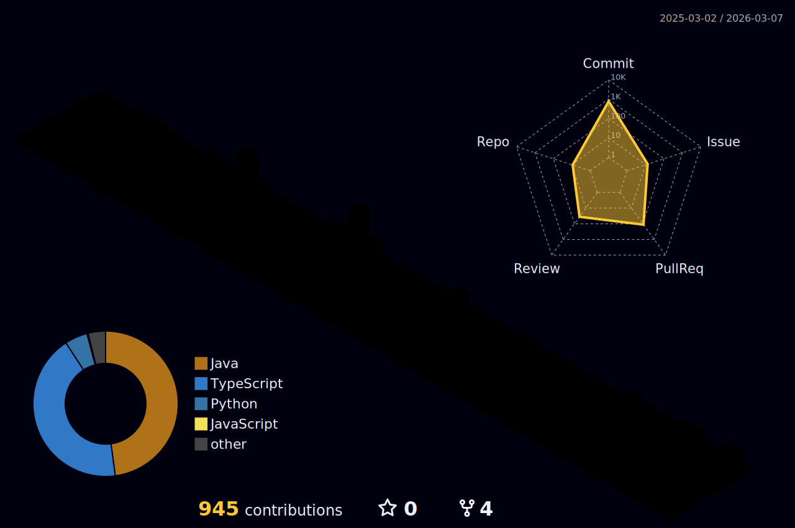

  

<h2>🍊🍊</h2>

<ul>
  <li><b>명지대학교 컴퓨터공학과</b> (2022.03 - )</li>
  <li><b>UMC Web(React) 트랙 7기</b> (2024.09 - 2025.02)</li>
  <li>
    <b>제 3회 오픈데이터포럼(ODF) 해커톤 최우수상</b> (2024.10) 
    &nbsp;&nbsp;- 놀이터백과: 놀이터 위치 · 주변 정보 제공 서비스
  </li>
  <li><b>디지털 리터러시 배움터 교육 봉사 프로그램</b> (2024.11 - 2024.12)</li>
  <li><b>2025 GDGoC KR HACKATHON: 백야 참가</b> (2025.01)</li>
  <li><b>연합 IT 동아리 It's Time 7th FE</b> (2025.03 - 2025.07)</li>
  <li><b>UMC Server(Spring) 트랙 8기</b> (2025.03 - 2025.08)</li>
  <li><b>KT 대학생 IT 서포터즈 KIT 3기</b> (2025.05 - 2025.08)</li>
</ul>

 

